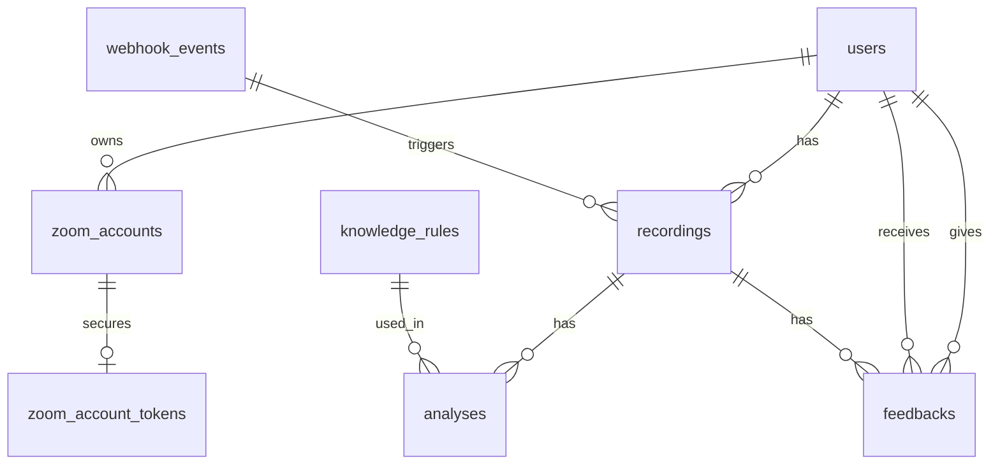

# Sales Call Analysis - 詳細設計書 (最終改訂版)

## 1. データベース詳細設計

Supabase (PostgreSQL) を使用し、RLS（Row Level Security）を適用してデータのアクセス制御を行います。セキュリティとパフォーマンスのため、JWTによる認証機構の見直し、機密情報の暗号化と分離、PII（個人特定情報）のライフサイクル管理、および整合性制約の強化を行いました。

### 1.1 ER図（概要）



### 1.2 SQL関数定義

#### `role_check()`
RLSポリシー内で現在のユーザーのロールを安全に参照するための関数です。
プロファイルが存在しない異常系に対し、安全なデフォルト値を返すことでNULL参照エラーを防ぎます。

```sql
-- セキュリティ定義: INVOKER (呼び出し元の権限で実行)
CREATE OR REPLACE FUNCTION public.role_check()
RETURNS text
LANGUAGE plpgsql
SECURITY INVOKER
STABLE
AS $$
DECLARE
  v_role text;
BEGIN
  -- profilesテーブルからロールを取得
  SELECT role INTO v_role FROM public.profiles WHERE id = auth.uid();

  -- プロファイルが存在しない場合、またはロールがNULLの場合の安全性対策
  -- 通常はauth.usersとprofilesの作成がAtomicであることが前提だが、
  -- 不整合が発生した場合の挙動を安定させるため 'sales' (最も権限の低いロール) を返す。
  IF v_role IS NULL THEN
    RETURN 'sales';
  END IF;

  RETURN v_role;
END;
$$;
```

#### `get_zoom_token(account_id uuid)`
Zoomトークン取得用のRPC関数です。バックエンドプロセス（サービスロール）のみが実行可能です。
Vaultの利用を明示化し、キー未設定時やレコード不在時のエラーハンドリングを強化しました。

```sql
-- セキュリティ定義: SECURITY DEFINER (関数所有者の権限で実行)
-- 所有者: postgres (またはスーパーユーザー権限を持つロール)
CREATE OR REPLACE FUNCTION private.get_zoom_token(account_id uuid)
RETURNS TABLE (
  access_token text,
  refresh_token text,
  expires_at timestamptz,
  key_version integer
)
LANGUAGE plpgsql
SECURITY DEFINER
SET search_path = private
AS $$
DECLARE
  v_owner_id uuid;
  v_encrypted_access text;
  v_encrypted_refresh text;
  v_token_id uuid;
  v_token_expires_at timestamptz; -- 変数宣言を追加
  v_key_version integer;          -- 変数宣言を追加
  v_encryption_key text;          -- 暗号化キー検証用変数を追加
BEGIN
  -- 1. リクエスト元がサービスロールキーを持つバックエンドプロセスか確認
  IF NOT (auth.role() = 'service_role') THEN
    RAISE EXCEPTION 'Unauthorized: Service role required' USING ERRCODE = '22023';
  END IF;

  -- 2. 関連するZoomアカウントの所有者とトークンIDを取得
  -- 修正: レコード存在チェックを追加
  SELECT owner_id, token_id INTO v_owner_id, v_token_id
  FROM public.zoom_accounts 
  WHERE id = account_id;

  IF NOT FOUND THEN
    RAISE EXCEPTION 'Zoom account not found for ID %', account_id USING ERRCODE = '42704';
  END IF;

  -- 3. 暗号化トークンの取得と存在チェック
  SELECT 
    access_token_encrypted, 
    refresh_token_encrypted, 
    token_expires_at, 
    key_version
  INTO v_encrypted_access, v_encrypted_refresh, v_token_expires_at, v_key_version
  FROM private.zoom_account_tokens
  WHERE id = v_token_id;

  -- トークンレコードが見つからない場合の制御されたエラー
  IF NOT FOUND THEN
    RAISE EXCEPTION 'Zoom token not found for account %', account_id USING ERRCODE = '42704';
  END IF;

  -- 4. 復号化処理
  -- 修正: 暗号化キーを事前に取得・検証し、NULLの場合はエラーとする
  v_encryption_key := current_setting('app.encryption_key', true);
  
  IF v_encryption_key IS NULL OR v_encryption_key = '' THEN
    RAISE EXCEPTION 'Encryption key is not configured in Vault' USING ERRCODE = '22004'; // NULL_VALUE_NOT_ALLOWED
  END IF;

  -- 変数を正しく使用して復号化
  RETURN QUERY
  SELECT 
    pgp_sym_decrypt(v_encrypted_access, v_encryption_key),
    pgp_sym_decrypt(v_encrypted_refresh, v_encryption_key),
    v_token_expires_at,
    v_key_version;
END;
$$;

-- 実行権限の付与（サービスロールのみ）
GRANT EXECUTE ON FUNCTION private.get_zoom_token TO service_role;
```

### 1.3 テーブル定義

#### `profiles` (Supabase Auth拡張)
認証情報およびロール管理を行います。

| カラム名 | 型 | 制約 | デフォルト | 説明 |
| :--- | :--- | :--- | :--- | :--- |
| id | uuid | PK | uuid_generate_v4() | Supabase AuthのユーザーIDと紐付け |
| email | text | NOT NULL | | メールアドレス |
| full_name | text | | | 氏名 |
| role | text | NOT NULL | 'sales' | 'admin', 'sales' (**RLSの正となる情報**) |
| zoom_user_id | text | | | Zoomアカウントとの紘付け用ID |
| created_at | timestamptz | NOT NULL | now() | 作成日時 |

**RLSポリシー (WITH CHECK付き):**
*   **Enable RLS**: ON
*   **Admin Access**: 
    *   `USING (public.role_check() = 'admin')`
    *   `WITH CHECK (public.role_check() = 'admin')`
*   **Self Access**: 
    *   `USING (auth.uid() = id)`
    *   `WITH CHECK (auth.uid() = id)`
*   **Role Update Protection**: ロール変更はサーバーサイドのRPC関数経由のみ許可（直接UPDATE不可）。

#### `zoom_accounts`
管理者が管理するZoomアカウント情報。

| カラム名 | 型 | 制約 | デフォルト | 説明 |
| :--- | :--- | :--- | :--- | :--- |
| id | uuid | PK | uuid_generate_v4() | |
| owner_id | uuid | FK -> profiles.id | NOT NULL | このZoomアカウントの使用者（営業担当者） |
| display_name | text | NOT NULL | | アカウント識別名 |
| zoom_user_email | text | NOT NULL | | Zoomのログインメールアドレス |
| token_id | uuid | FK -> zoom_account_tokens.id | UNIQUE | トークン情報への外部キー |
| is_active | boolean | NOT NULL | true | アカウントが有効かどうか |
| last_synced_at | timestamptz | | | 最後にZoom APIを叩いた日時 |

**インデックス:**
*   `idx_zoom_accounts_owner_id`: `(owner_id)` -- RLSパフォーマンス最適化のため追加

**RLSポリシー (WITH CHECK付き):**
*   **SELECT**: 
    *   Admin: `USING (public.role_check() = 'admin')`
    *   Sales: `USING (owner_id = auth.uid())`
*   **INSERT/UPDATE/DELETE**: 
    *   `USING (public.role_check() = 'admin')`
    *   `WITH CHECK (public.role_check() = 'admin')`

#### `zoom_account_tokens` (新規)
セキュリティ強化のため、トークン情報を分離しました。

| カラム名 | 型 | 制約 | デフォルト | 説明 |
| :--- | :--- | :--- | :--- | :--- |
| id | uuid | PK | uuid_generate_v4() | |
| access_token_encrypted | text | NOT NULL | | **暗号化された** Access Token (pgcrypto) |
| refresh_token_encrypted | text | | | **暗号化された** Refresh Token |
| token_expires_at | timestamptz | NOT NULL | | トークン有効期限 |
| key_version | integer | NOT NULL | 1 | **暗号化キーバージョン** (ローテーション用) |
| updated_at | timestamptz | NOT NULL | now() | 更新日時 |

**キーローテーションと管理詳細:**
*   **保管場所**: Supabase Vault (`vault.decrypted` 関数経由でアクセス)。
*   **アクセス制御**: `service_role` キーを持つバックエンドプロセスのみが復号可能。
*   **ローテーション手順**: 90日ごとにVault内のキーを更新し、`key_version` をインクリメント。
*   **再暗号化**: デュアルキーサポート期間中（旧バージョンのキーもVaultに保持）にバックグラウンド処理で順次再暗号化を行う。
*   **監査ログ**: すべての復号操作およびキーアクセスログを `audit_logs` テーブルへ記録。

**RLSポリシー:**
*   **SELECT/INSERT/UPDATE/DELETE**: 
    *   `USING (false)` 
    *   `WITH CHECK (false)` （**明示的な拒否設定を追加**）
*   **代替アクセス手段**: バックエンドからは `private.get_zoom_token()` RPC関数経由のみアクセス許可。

#### `recordings`
Zoomから取得した録画データのメタ情報。

| カラム名 | 型 | 制約 | デフォルト | 説明 |
| :--- | :--- | :--- | :--- | :--- |
| id | uuid | PK | uuid_generate_v4() | |
| zoom_account_id | uuid | FK -> zoom_accounts.id | NOT NULL | 誰の録画か |
| zoom_recording_id | text | NOT NULL UNIQUE | | Zoom側の録画ID |
| topic | text | | | ミーティングタイトル |
| start_time | timestamptz | NOT NULL | | 開始時刻 |
| duration | integer | | | 秒数 |
| video_url | text | | | ダウンロード用URL |
| file_path | text | | | Supabase Storage内のパス |
| **status** | recordings_status | NOT NULL | 'pending' | **CHECK制約付き状態管理** |
| **deleted_at** | timestamptz | | | **Soft Delete削除日時** |
| created_at | timestamptz | NOT NULL | now() | DB登録日時 |

**制約定義 (SQL):**
```sql
CREATE TYPE recordings_status AS ENUM (
  'pending', 'downloading', 'ready', 
  'transcribing', 'transcribed', 
  'analyzing', 'completed', 'failed'
);
ALTER TABLE recordings ADD COLUMN status recordings_status NOT NULL DEFAULT 'pending';
```

**インデックス (パフォーマンス対応):**
*   `idx_recordings_zoom_account_id`: `(zoom_account_id)`
*   `idx_recordings_status`: `(status)`
*   `idx_recordings_created_at`: `(created_at DESC)`
*   `idx_recordings_complex`: `(zoom_account_id, status, created_at DESC)` -- マイページ用
*   `idx_recordings_deleted_at`: `(deleted_at)` WHERE `deleted_at IS NULL` -- 部分インデックス

**PII管理ポリシー (Race Condition対策):**
*   **削除フロー (2フェーズ削除)**:
    1.  **Soft Delete**: `deleted_at` を設定し、UIから非表示化。
    2.  **Hard Delete**: 24時間後にバックエンドジョブがトランザクション内でStorageファイル、DBレコード、関連AnalysesをCASCADE削除。
*   **べき等性**: ジョブIDごとに処理状況を記録し、重複削除を防止。
*   **トランザクション境界**: 
    *   BEGIN
    *   SELECT ... FOR UPDATE (レコードロック)
    *   DELETE FROM storage (Supabase API呼び出し)
    *   DELETE FROM recordings WHERE ... CASCADE
    *   COMMIT
*   **補償クリーンアップ**: 削除失敗時は `deleted_at` を残し、次回ジョブ実行時にリトライ。

**署名付きURL (Share URL) の取り扱い:**
*   **ポリシー**: DBには保存しない。
*   **生成**: クライアントの再生リクエストごとにサーバーサイドで生成。
*   **実装**: Route HandlersにてSupabase Storageの `createSignedUrl` を呼び出し、TTL 15分で返却。

**RLSポリシー (WITH CHECK付き):**
*   **SELECT**: Admin全件。Salesは `zoom_accounts.owner_id` が自分のIDと一致するもののみ。
    *   *修正案（パフォーマンス最適化）*: `USING (deleted_at IS NULL AND EXISTS (SELECT 1 FROM zoom_accounts za WHERE za.id = recordings.zoom_account_id AND za.owner_id = auth.uid()))`
*   **INSERT/UPDATE/DELETE**: Adminのみ。

#### `webhook_events`
Zoom Webhookのべき等性を保証するためのイベント履歴テーブルです。

| カラム名 | 型 | 制約 | デフォルト | 説明 |
| :--- | :--- | :--- | :--- | :--- |
| id | uuid | PK | uuid_generate_v4() | |
| event_id | text | NOT NULL UNIQUE | | `X-Zoom-Request-Id` ヘッダーの値 |
| received_at | timestamptz | NOT NULL | now() | イベント受信時刻 |
| processed_at | timestamptz | | | 処理完了時刻 |

**TTL管理:**
*   24時間経過したレコードは自動的にパージ（PgBouncerや定期ジョブで `DELETE FROM webhook_events WHERE received_at < now() - interval '24 hours'`）。

#### `knowledge_rules`
営業ナレッジ・チェックリスト。

| カラム名 | 型 | 制約 | デフォルト | 説明 |
| :--- | :--- | :--- | :--- | :--- |
| id | uuid | PK | uuid_generate_v4() | |
| title | text | NOT NULL | | ルール名 |
| category | text | | | カテゴリ |
| content | text | NOT NULL | | Markdown形式の本文 |
| prompt_instructions | text | | | AI分析時に使うためのプロンプト指示 |
| is_active | boolean | NOT NULL | true | |
| created_at | timestamptz | NOT NULL | now() | |

**RLSポリシー:**
*   **SELECT**: Admin, Sales (閲覧のみ)。
*   **INSERT/UPDATE/DELETE**: Adminのみ。

#### `analyses`
録画に対するAI分析結果。

| カラム名 | 型 | 制約 | デフォルト | 説明 |
| :--- | :--- | :--- | :--- | :--- |
| id | uuid | PK | uuid_generate_v4() | |
| recording_id | uuid | FK -> recordings.id | NOT NULL UNIQUE | **ON DELETE CASCADE** |
| transcript_json | jsonb | | | Whisper APIの結果 |
| issues_json | jsonb | | | GPT-4が検出した問題箇所の配列 |
| summary_text | text | | | 通話の要約 |
| created_at | timestamptz | NOT NULL | now() | |

**インデックス:**
*   `idx_analyses_recording_id`: `(recording_id)`

**RLSポリシー:**
*   **SELECT**: Admin全件。Salesは自分が所有する `recordings` に紐づくもののみ。
*   **INSERT/UPDATE/DELETE**: Adminのみ（またはシステム）。

#### `feedbacks`
管理者が作成したフィードバックとクリップ情報。

| カラム名 | 型 | 制約 | デフォルト | 説明 |
| :--- | :--- | :--- | :--- | :--- |
| id | uuid | PK | uuid_generate_v4() | |
| recording_id | uuid | FK -> recordings.id | NOT NULL | |
| created_by | uuid | FK -> profiles.id | NOT NULL | 作成者（管理者） |
| target_user_id | uuid | FK -> profiles.id | NOT NULL | フィードバック対象者 |
| clip_url | text | | | 生成された動画クリックのURL |
| clip_start_ms | integer | | | **クリップ開始位置(ミリ秒)** |
| clip_end_ms | integer | | | **クリップ終了位置(ミリ秒)** |
| content | text | NOT NULL | | フィードバック本文 |
| **status** | feedbacks_status | NOT NULL | 'draft' | **CHECK制約付き状態管理** |
| shared_at | timestamptz | | | 共有日時 |

**制約定義 (SQL):**
```sql
CREATE TYPE feedbacks_status AS ENUM ('draft', 'shared');
ALTER TABLE feedbacks ADD COLUMN status feedbacks_status NOT NULL DEFAULT 'draft';
```

**インデックス:**
*   `idx_feedbacks_recording_id`: `(recording_id)`
*   `idx_feedbacks_target_user_id`: `(target_user_id)`

**RLSポリシー:**
*   **SELECT**: Admin全件。Salesは `target_user_id` が自分のIDと一致するもののみ。
*   **INSERT/UPDATE/DELETE**: Adminのみ。

---

## 2. API設計

Next.js App Routerの Route Handlers (`app/api/*/route.ts`) で実装します。

### 2.1 共通仕様

**認証・認可ミドルウェア:**
*   **認証**: `Authorization` ヘッダーからSupabase JWTを検証。
*   **認可 (RBAC)**: DBの `profiles.role` を参照。
*   **サービスロールバイパスの防止**: Web API Route Handler内ではサービスロールキーを使用せず、必���エンドユーザーのJWT（`auth.uid()`）を使用したRLSクエリを実行します。

**レート制限 (Fail-Open/Closed定義):**
*   **Upstash Redis** 使用。
*   **動作モード**:
    *   **セキュリティ重要エンドポイント (ログイン、トークン更新など)**: **Fail-Closed**（Redis接続不可時はリクエストを拒否）。
    *   **その他エンドポイント**: **Fail-Open with Reduced Limit**（Redis接続不可時はローカルカウンター等で厳格な制限を実施）。
*   **運用影響**: Redis停止時は、Fail-Closedエンドポイントを含む一部機能が利用できなくなる可能性があります。

### 2.2 外部連携 Webhook API

*   **POST `/api/webhooks/zoom-recording-complete`**
    *   **認証**: Zoom Webhook Secret を使用したHMAC署名検証。
    *   **詳細実装**:
        1.  リクエストボディ (Raw string) を取得。
        2.  `X-Zoom-Signature` ヘッダーとSecretを用いてHMAC-SHA256を計算。
        3.  **タイミングセーフ比較**: `crypto.timingSafeEqual()` を使用して、計算値とヘッダー値を比較（文字列比較の時間差攻撃を防止）。
        4.  **タイムスタンプ検証**: `X-Zoom-Request-Timestamp` がサーバー時刻から ±5分以内であるか検証。
        5.  **べき等性**: DBに `X-Zoom-Request-Id` を `webhook_events` テーブルへ `INSERT ... ON CONFLICT (event_id) DO NOTHING` で保存（Atomic重複排除）。

---

## 3. 画面設計

### 3.1 共通レイアウト
*   **サイドバー**: ダッシュボード、録画一覧、ナレッジ管理、設定、ログアウト。
*   **ヘッダー**: ユーザー名、ロール表示。

### 3.2 画面詳細

#### 1. 録画詳細・分析画面 (`/recordings/:id`)
*   **機能**:
    *   動画再生、インタラクティブなタイムライン。
*   **セキュリティ (XSS対策 - Markdownサニタイズ):**
    *   **クライアントサイド**:
        *   パーサー: `marked` (設定: `headerIds: false`, `mangle: false`)
        *   サニタイザ: **DOMPurify** を使用し、レンダリング前にHTMLを浄化。
    *   **サーバーサイド (保存時・API応答時)**:
        *   サニタイザ: `sanitize-html` を使用し、下記単一の許可リストに基づいたタグのみを通す。

#### 2. ナレッジ管理 (`/knowledge`)
*   **セキュリティ**:
    *   Notion同期時および保存時に、サーバーサイドで危険なタグを削除します。
    *   表示時は録画詳細画面と同様に `marked` + `DOMPurify` のパイプラインを使用します。

---

## 4. 処理フロー詳細

### 4.1 サニタイズ許可リスト定義

クライアントサイド（DOMPurify）とサーバーサイド（sanitize-html）の仕様の違いに対応するため、ライブラリ別の設定定義を作成しました。
*修正点*: ライブラリごとの正しいプロパティ名（`allowedTags` vs `ALLOWED_TAGS`）を使用し、`target="_blank"` 時のセキュリティ脆弱性対策として `rel` 属性を強制付与します。

**サーバーサイド (sanitize-html) 用設定**

```javascript
// lib/sanitize-server.js
import sanitizeHtml from 'sanitize-html';

export const sanitizeHtmlServer = (dirty) => {
  return sanitizeHtml(dirty, {
    allowedTags: [
      'h1', 'h2', 'h3', 'h4', 'h5', 'h6',
      'blockquote', 'p', 'a', 'ul', 'ol',
      'li', 'b', 'i', 'strong', 'em', 'strike', 'code', 'hr', 'br', 'div',
      'table', 'thead', 'caption', 'tbody', 'tr', 'th', 'td', 'pre'
    ],
    allowedAttributes: {
      a: ['href', 'name', 'target'],
      '*': ['class'],
    },
    allowedSchemes: ['http', 'https', 'mailto'],
    allowedSchemesAppliedToAttributes: ['href', 'src'],
    // transformTagsでtarget="_blank"時のrel属性を強制
    transformTags: {
      a: (tagName, attribs) => {
        if (attribs.target === '_blank') {
          attribs.rel = 'noopener noreferrer';
        }
        return { tagName, attribs };
      }
    }
  });
};
```

**クライアントサイド (DOMPurify) 用設定**

```javascript
// lib/sanitize-client.js
import DOMPurify from 'isomorphic-dompurify';

// DOMPurifyのデフォルト設定をカスタマイズ
const PURIFY_CONFIG = {
  ALLOWED_TAGS: [
    'h1', 'h2', 'h3', 'h4', 'h5', 'h6',
    'blockquote', 'p', 'a', 'ul', 'ol',
    'li', 'b', 'i', 'strong', 'em', 'strike', 'code', 'hr', 'br', 'div',
    'table', 'thead', 'caption', 'tbody', 'tr', 'th', 'td', 'pre'
  ],
  ALLOWED_ATTR: [
    'href', 'name', 'target', 'class'
  ],
  // ALLOW_DATA_ATTRなどはデフォルトでfalse
};

export const sanitizeHtmlClient = (dirty) => {
  return DOMPurify.sanitize(dirty, PURIFY_CONFIG);
};
```

### 4.2 Zoom録画自動取得フロー

1.  **トリガー**: Cron Job または Zoom Webhook。
2.  **APIリクエスト**: `private.get_zoom_token(account_id)` RPC経由でトークンを取得（`key_version` 考慮済み）。
3.  **データ保存**: Supabase Storageへのダウンロード完了後、`status` を更新。
4.  **分析トリガー**: 分析キューにジョブを追加。

### 4.3 文字起こしフロー (Groq API + Whisper)

1.  **音声抽出**: FFmpegで音声抽出。
2.  **Groq API リクエスト**: Whisper Large V3 モデル。
3.  **エラーハンドリング**: 指数バックオフ（初期1秒、指数関数的に増加、ジッター +/- 30%追加）で最大3回リトライ。
4.  **結果保存**: トランザクション内で `analyses` テーブルへ保存し、`recordings.status` を更新。

### 4.4 AI分析フロー (GPT-4 / Claude)

1.  **プロンプト構築**: `knowledge_rules` を参照。
2.  **API リクエスト**: GPT-4 Turboなど。
3.  **結果処理**: APIエラー時は4.3と同様のバックオフでリトライ。
4.  **べき等性**: ジョブIDを用いて、分析完了の再保存を防ぐ。

### 4.5 フィードバック作成・クリップ生成フロー

1.  **入力正規化・検証**:
    *   クライアントから送られた秒を整数ミリ秒に変換。
    *   0 <= `clip_start_ms` < `clip_end_ms` <= `duration * 1000` をサーバーサイドで厳密に検証。
2.  **クリップ生成 (FFmpeg)**:
    *   `fluent-ffmpeg` ライブラリを使用し、引数として安全に渡す（コマンドインジェクション対策）。
3.  **通知**: Supabase Realtimeまたはメールで通知。

### 4.6 Notionナレッジ同期フロー

1.  **Notion API**: ページ一覧およびブロック内容を取得。
2.  **サニタイズ**: 取得したMarkdown/HTMLテキストから、各ライブラリの設定（4.1）に基づき危険なタグを除去またはエスケープして `knowledge_rules` へUpsert。

---

## 5. 信頼性・エラーハンドリング強化

### 5.1 サーキットブレーカー / DLQ (Dead Letter Queue) 設計

外部API（Zoom, Groq, OpenAI）との連携におけるカスケード障害を防ぐための仕様です。

**サーキットブレーカー設定:**
*   **しきい値**: 連続して5回失敗するとサーキットをOPEN（開放）し、リクエストを停止する。
*   **リカバリ**: 60秒後にHALF_OPEN状態へ移行し、1回リクエストを試行。成功すればCLOSEDへ、失敗すれば再度OPENへ。
*   **実装ライブラリ**: `cockatiel` (TypeScript) や `opossum` 等、APIゲートウェイレイヤーまたはJob Worker内で実装。

**DLQ (Dead Letter Queue):**
*   **定義**: リトライ回数上限（最大3回）を超えても失敗したジョブを `failed_jobs` テーブル（またはSupabase Queueの機構）へ移動。
*   **アラート**: DLQへのエントリが発生した場合、SlackやEmailへ即時通知。
*   **再試行**: 管理者が手動で再実行するか、一定時間経過後に自動リトライ（指数バックオフ延長）。

---

## 6. 外部連携仕様

### Zoom API
*   **認証**: Server-to-Server OAuth。
*   **トークン管理**: `private.get_zoom_token()` RPC関数経由でアクセス。
*   **Webhook**: 署名検証、タイムスタンプ検証、タイミングセーフ比較、`webhook_events` テーブルを使用したべき等性保証を実装。

### Groq API
*   **用途**: 音声認識（Whisper）。
*   **エラーハンドリング**: 指数バックオフ + ジッターによるリトライ。サーキットブレーカー適用。

### FFmpeg
*   **実行環境**: Supabase Edge Functions (Docker)。
*   **セキュリティ**: ユーザー入力を直接コマンドライン文字列に埋め込まない。

### Notion API
*   **データ同期**: 管理者の手動トリガー、または定期ジョブで実行。