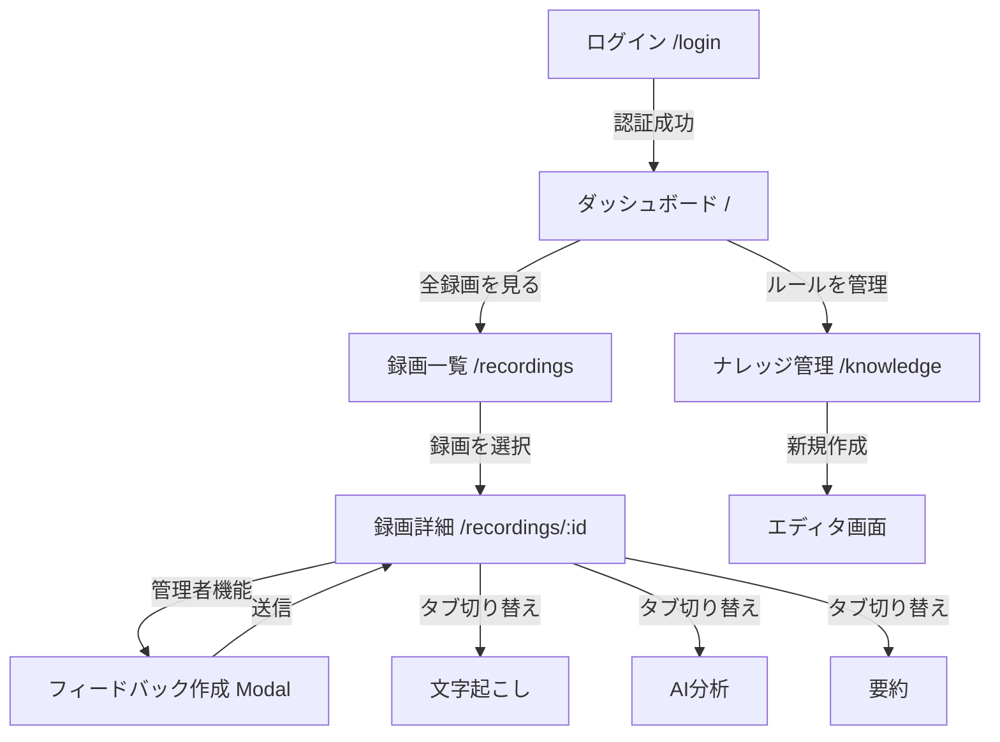

# Sales Call Analysis UI 詳細設計書

**プロジェクト名**: Sales Call Analysis
**バージョン**: 1.0.0
**作成日**: 2023-10-27
**技術スタック**: Next.js 14 (App Router), TypeScript, Tailwind CSS, TanStack Query, Zustand

---

## 1. デザインシステム

### 1.1 カラーパレット (Tailwind Config)

営業職が長時間使用しても目が疲れないよう、ビジネスライクでコントラストのはっきりしたブルーベースを採用します。

```ts
// tailwind.config.ts
colors: {
  primary: {
    50: '#eff6ff',
    100: '#dbeafe',
    500: '#3b82f6', // Main Brand Color
    600: '#2563eb', // Hover
    700: '#1d4ed8', // Active
  },
  secondary: {
    50: '#f8fafc',
    500: '#64748b', // Text secondary, borders
    900: '#0f172a', // Headings
  },
  accent: {
    500: '#8b5cf6', // AI features, highlights
  },
  semantic: {
    success: '#10b981', // Positive feedback, completed
    warning: '#f59e0b', // Pending review
    error: '#ef4444',   // Critical issue, delete
    info: '#06b6d4',    // Information
  },
  gray: {
    50: '#f9fafb',  // Background
    100: '#f3f4f6', // Card background, borders
    200: '#e5e7eb', // Divider
    800: '#1f2937', // Body text
  }
}
```

### 1.2 タイポグラフィ

フォントは英語・日本語ともに可読性を重視し、インターフェース用途に最適化された `Noto Sans JP` と `Inter` を使用します。

| 用途 | クラス例 | 適用箇所 |
| :--- | :--- | :--- |
| **H1** | `text-3xl font-bold text-secondary-900` | ページタイトル |
| **H2** | `text-2xl font-semibold text-secondary-900` | セクションタイトル |
| **H3** | `text-lg font-medium text-secondary-900` | カードタイトル |
| **Body** | `text-sm text-gray-800` | 本文、説明文 |
| **Caption** | `text-xs text-gray-500` | タイムスタンプ、ラベル |

### 1.3 スペーシング & レイアウト
- **基本単位**: 4px (0.25rem)
- **コンテナ幅**: `max-w-7xl` (1280px)
- **セクション余白**: `py-8` (32px) または `py-12` (48px)

### 1.4 ブレイクポイント
- **sm**: 640px (Mobile Large)
- **md**: 768px (Tablet)
- **lg**: 1024px (Desktop)
- **xl**: 1280px (Desktop Wide)
- **2xl**: 1536px (Large Screens)

---

## 2. コンポーネント定義

### 2.1 基本コンポーネント

#### Button (`components/ui/Button.tsx`)
```tsx
type ButtonVariant = 'primary' | 'secondary' | 'outline' | 'ghost' | 'danger';
type ButtonSize = 'sm' | 'md' | 'lg';

interface ButtonProps {
  variant?: ButtonVariant;
  size?: ButtonSize;
  isLoading?: boolean;
  children: React.ReactNode;
  onClick?: () => void;
}

// Style Map (Tailwind Classes)
// primary: bg-primary-500 text-white hover:bg-primary-600
// danger: bg-semantic-error text-white hover:bg-red-700
// outline: border border-gray-300 bg-white hover:bg-gray-50
```

#### Input (`components/ui/Input.tsx`)
```tsx
interface InputProps extends React.InputHTMLAttributes<HTMLInputElement> {
  label?: string;
  error?: string;
  icon?: React.ReactNode;
}
// Implemented using standard input with ring-offset for focus states
// className="w-full rounded-md border-gray-300 shadow-sm focus:border-primary-500 focus:ring-primary-500 sm:text-sm"
```

#### Badge (`components/ui/Badge.tsx`)
状態表示に使用します。
```tsx
type Status = 'analyzed' | 'pending' | 'draft' | 'issue';

interface BadgeProps {
  status: Status;
  label: string;
}

// Variants:
// analyzed: bg-green-100 text-green-800
// pending: bg-yellow-100 text-yellow-800
// issue: bg-red-100 text-red-800
```

### 2.2 レイアウトコンポーネント

#### AppLayout (`components/layout/AppLayout.tsx`)
サイドバーとヘッダーを含むアプリケーションの基本レイアウトです。

```tsx
interface AppLayoutProps {
  children: React.ReactNode;
  role: 'admin' | 'sales';
}
```
- **Sidebar**: 左端固定幅 (w-64)。モバイル時はドロワー。
- **Header**: 上部固定。ユーザーアバター、ロール、通知アイコンを配置。

### 2.3 機能コンポーネント

#### VideoPlayer (`components/VideoPlayer.tsx`)
Zoom録画とAI解析結果を連携させるためのカスタムプレイヤーです。

```tsx
interface VideoPlayerProps {
  src: string;
  currentTime: number;
  onTimeUpdate: (time: number) => void;
  markers?: number[]; // AI抽出問題箇所のタイムスタンプ配列
  onMarkerClick?: (time: number) => void;
}
```
- **実装方針**: `react-player` または HTML5 Video API を使用。
- **UI**: シークバーにマーカー（赤いドット）を表示。クリックで該当シーンへジャンプ。

#### TranscriptViewer (`components/TranscriptViewer.tsx`)
```tsx
interface TranscriptSegment {
  id: string;
  text: string;
  speaker: 'Agent' | 'Customer';
  startTime: number;
  isIssue?: boolean; // AIが検出した問題箇所かどうか
}

interface TranscriptViewerProps {
  segments: TranscriptSegment[];
  onSeek: (time: number) => void;
  currentTime: number; // 現在再生中の箇所をハイライト
}
```
- **インタラクション**: テキスト行をクリックすると、動画のその時刻へシークする。

#### IssueCard (`components/IssueCard.tsx`)
分析結果で抽出された「問題箇所」を表示するカード。

```tsx
interface Issue {
  id: string;
  category: 'talking_speed' | 'interruption' | 'missed_info';
  timestamp: number;
  description: string;
  severity: 'low' | 'medium' | 'high';
}

interface IssueCardProps {
  issue: Issue;
  onPlayFrom: (time: number) => void;
}
```

---

## 3. 画面設計

### 3.1 ログイン画面 (`/login`)

**レイアウト**: `min-h-screen flex items-center justify-center bg-gray-50`

| 要素 | 詳細 | Spec |
| :--- | :--- | :--- |
| **ロゴ** | アプリケーションロゴ | サイズ: h-12 |
| **カード** | 白い背景、角丸、シャドウ | `bg-white p-8 rounded-xl shadow-md w-full max-w-md` |
| **入力フォーム** | メール、パスワード | `space-y-4` |
| **ログインボタン** | プライマリカラー | `w-full` |

**状態遷移**:
- **初期**: 入力可能
- **Loading**: ボタンにSpinner表示、入力不可
- **Error**: パスワード上部にToastまたはテキストでエラーメッセージ表示

### 3.2 ダッシュボード (`/`)

権限により表示内容が大きく異なります。

**管理者向け**
- **StatCard**: 4つ並び (録画数, 分析完了, 保留中, フィードバック率)
- **セクション1**: "未分析の録画" (Table形式、最大5件)
- **セクション2**: "最近のアクティビティ" (フィードバック作成履歴)

**営業担当者向け**
- **StatCard**: 今月の評価スコア, 未読フィードバック数
- **セクション1**: "あなたの最近の録画" (RecordingCard Grid)
- **セクション2**: "最近のフィードバック" (IssueCardベースのリスト)

### 3.3 録画一覧 (`/recordings`)

**フィルタバー**:
- 日付範囲 (`DateRangePicker`)
- 担当者ドロップダウン (管理者のみ)
- ステータスタブ (すべて | 分析済み | 未分析 | フィードバックあり)

**リスト表示 (DataTable)**:
| カラム | 説明 |
| :--- | :--- |
| サムネイル | 動画プレビュー画像 |
| 担当者 | Avatar + Name |
| 日付 | YYYY/MM/DD |
| 分析ステータス | Badge (Pending / Analyzed) |
| フィードバック | Badge / Count |
| アクション | "詳細を見る" ボタン |

### 3.4 録画詳細・分析画面 (`/recordings/:id`)

**レイアウト**: 2カラム (md以上)

**左カラム (Video Section - 固定)**
- **VideoPlayer**: 幅100%、Aspect Ratio 16:9
- **メタデータ**: 件名、日付、通話時間、相手社名

**右カラム (Details - スクロール可能)**
- **Tabs**:
  1.  **文字起こし (Transcript)**:
      - `TranscriptViewer` を使用
      - 現在再生中の行をハイライト (bg-yellow-50)
  2.  **AI分析 (Issues)**:
      - `IssueCard` のリスト
      - 重要度順にソート
  3.  **要約**:
      - LLMによる要約テキスト

**管理者用アクション**:
- 右下にFAB (Floating Action Button) またはヘッダー付近にボタンで「フィードバックを作成」を配置。

### 3.5 フィードバック作成モーダル (`/recordings/:id/feedback`)

**実装**: `Dialog` or `Modal` コンポーネント

**構成**:
1.  **ヘッダー**: "フィードバックの作成"
2.  **動画プレビュー** (小型):
    - 開始時間・終了時間を選択するスライダー、または現在の再生時間から引用ボタン。
3.  **フォーム**:
    -   **カテゴリ選択**: Select (商談テクニック, 商品知識, マナーなど)
    -   **重要度**: Radio (High, Medium, Low)
    -   **内容**: Textarea (改善点の具体的な記述)
4.  **フッター**: キャンセル / 送信ボタン

### 3.6 ナレッジ管理 (`/knowledge`)

**管理者専用画面**。フィードバック時のテンプレートや営業ルールを管理します。

**レイアウト**:
- **Sidebar**: カテゴリツリー
- **Main**: ルール一覧テーブル
    - タイトル, カテゴリ, 最終更新日, アクション(編集/削除)
- **新規作成/編集**:
    - Markdownエディタ (ライブプレビュー付き)
    - Notion URLからのインポート機能

---

## 4. 状態管理アーキテクチャ

### 4.1 グローバル状態
認証情報とUIの状態を管理します。

```typescript
// stores/authStore.ts
interface AuthState {
  user: User | null;
  isAuthenticated: boolean;
  login: (email: string, password: string) => Promise<void>;
  logout: () => void;
}

// stores/uiStore.ts
interface UIState {
  isSidebarOpen: boolean;
  toggleSidebar: () => void;
  theme: 'light' | 'dark';
}
```

### 4.2 サーバー状態 (TanStack Query)
APIから取得するデータのキャッシュ、再取得、ローディング状態を管理します。

**Keys定数**:
```typescript
export const queryKeys = {
  recordings: ['recordings'] as const,
  recording: (id: string) => ['recordings', id] as const,
  feedbacks: ['feedbacks'] as const,
  knowledge: ['knowledge'] as const,
};
```

**フック例**:
```typescript
// hooks/useRecordings.ts
export const useRecordings = (filters: RecordingFilters) => {
  return useQuery({
    queryKey: [...queryKeys.recordings, filters],
    queryFn: () => api.fetchRecordings(filters),
  });
};
```

---

## 5. 画面遷移フロー



---

## 6. レスポンシブ対応ポリシー

| 画面サイズ | サイドバー | レイアウト |
| :--- | :--- | :--- |
| **モバイル** (< 768px) | 非表示 (ハンバーガーメニューでオーバーレイ表示) | シングルカラム。VideoPlayerは詳細画面で最上部固定。 |
| **タブレット** (768px - 1024px) | アイコンのみ表示 (省略モード) または折りたたみ | 基本的にシングルカラムだが、統計カード等はGrid折り返し。 |
| **デスクトップ** (> 1024px) | 常時表示 (テキストラベルあり) | 録画詳細画面は2カラム (Video固定 | Infoスクロール)。 |

---

## 7. 実装上の注意点

1.  **パフォーマンス**:
    - 録画一覧は無限スクロールまたはページネーションを実装し、初期表示を軽くする。
    - 動画プレビュー画像は適切なサイズにリサイズし、LazyLoadを行う。
2.  **アクセシビリティ (a11y)**:
    - 文字起こしテキストは十分なコントラスト比を確保する。
    - 動画プレイヤーはキーボード操作（Spaceで再生/停止など）に対応する。
3.  **エラーハンドリング**:
    - APIエラー時は、Toast通知でユーザーに通知し、アプリケーションをクラッシュさせない（Error Boundary実装）。